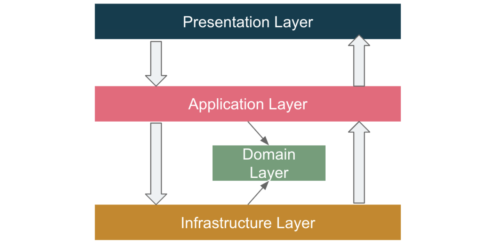

# Fast API Basic

## Overview

This project provides a foundational structure for building RESTful APIs using FastAPI, leveraging SQLAlchemy for object-relational mapping (ORM) and Alembic for database migrations. It adheres to Domain-Driven Design (DDD) principles for optimal code organization and maintainability.

## Features

- 🚀 FastAPI: High-performance, asynchronous web framework for building APIs.
- 🛡️ Sqlalchemy: Robust ORM for interacting with databases.
- 📘 Alembic: Powerful tool for managing database schema migrations.
- 🛠️ Ruff: An extremely fast Python linter and code formatter, written in Rust.
- 🔦 Pyright: Static Type Checker for Python.
- 💈 Pre-commit: A framework for managing and maintaining multi-language pre-commit hooks.
- 🚢 UV: Python packaging in Rust

## Setup

- Ensure you have Python 3 and pip installed on your system. To set up the project environment, run the following command:
- After have pip let install uv

```bash
pip install uv
```

```bash
make install
```

## How to start project

- To start the development server, use the following command:

```bash
make dev
```

## Script

- All necessary scripts for this project are listed in the Makefile. Please carefully review the Makefile and execute the desired script accordingly.

## Structure

The project follows Domain-Driven Design principles, with the following directory structure:

- presentation: Handles incoming requests and outgoing responses.
- application: Orchestrates business logic, coordinates domain objects
- domain: Defines the domain model and business entities.
- infrastructure: Manages external dependencies like databases and messaging systems.


